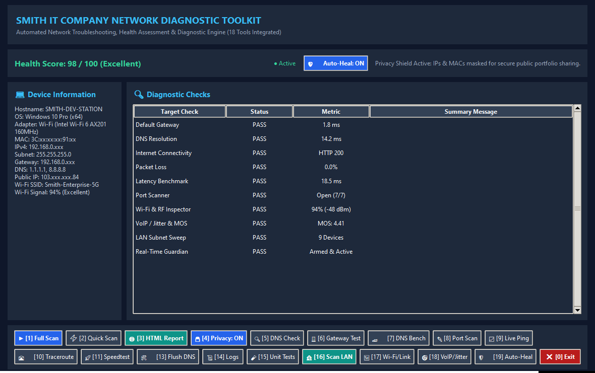

<p align="center">
  
</p>

<h1 align="center">Smith IT Company Network Diagnostic Toolkit 🛠️🌐</h1>

<p align="center">
  <a href="https://github.com/shawonsmith/smith-network-toolkit/actions/workflows/ci.yml"></a>
  <a href="https://www.python.org/"></a>
  <a href="LICENSE"></a>
  
</p>

A modular, lightweight network troubleshooting toolkit featuring a cross-platform diagnostic core and Windows-focused advanced repair and Wi-Fi inspection tools. Engineered for IT support students, junior systems engineers, helpdesk technicians, and small office administrators. It systematically diagnoses connectivity issues, assigns an empirical 0–100 health score, detects root causes (e.g., DHCP APIPA failure, DNS resolver freeze, ISP/upstream disruptions, local gateway latency), features an autonomous real-time self-healing watchdog daemon, and provides interactive terminal dashboards, modern HTML reports, and a Desktop GUI.

---

## Overview

Troubleshooting network issues on end-user machines often leads to guesswork: guessing whether the Wi-Fi is broken, if the router is down, if DNS has stalled, or if the ISP is suffering an upstream outage.

**Smith IT Company Network Diagnostic Toolkit** replaces guesswork with structured diagnostic evidence. In seconds, it audits:
- **Local Network Stack**: Hostname, OS, primary network interface, MAC address, IPv4 address, and subnet mask.
- **Gateway Reachability**: Local default router discovery and latency benchmark (with ICMP and TCP fallback).
- **Multi-Stage Internet Connectivity**: Differentiates between local LAN failure, ISP upstream loss, and DNS resolution failures.
- **Isolated DNS Performance**: Benchmarks domain resolution response times against major internet infrastructure independently of web browsing.
- **DNS Speed Benchmark**: Compares Cloudflare (1.1.1.1), Google (8.8.8.8), Quad9 (9.9.9.9), and OpenDNS (208.67.222.222) side-by-side.
- **Common Port & Firewall Scanner**: Tests critical service ports (HTTP 80, HTTPS 443, DNS 53, SSH 22, RDP 3389, SMTP 587, IMAP 993).
- **Hop-by-Hop Visual Traceroute**: Measures latency per router hop along the internet path (accounts for intermediate router ICMP rate-limiting).
- **Live Ping & Packet Drop Monitor**: Real-time continuous monitor with micro-drop detection for calls and gaming.
- **Internet Download Speed Test**: Direct CDN throughput measurement reporting real-world connection speed in Mbps.
- **LAN Subnet Device Discovery**: Multi-threaded ARP/socket sweep listing all active IP addresses, physical MACs, and hostnames.
- **Advanced Wi-Fi Signal & Channel Inspector**: Signal %, estimated RSSI (dBm), 2.4/5/6 GHz channels, 802.11ax/ac/n generation, Rx/Tx link rates, and security cipher.
- **VoIP / Gaming Jitter Analyzer**: RFC 3550-style interarrival jitter estimation, packet loss %, and G.107-inspired estimated VoIP MOS score (1.0–4.5).
- **Autonomous Real-Time Self-Healing Guardian**: Low-overhead background daemon that detects DNS stalls, suspected local gateway/ARP communication issues, and DHCP assignment failures or invalid leases (APIPA), executing targeted auto-remediation in real time.
- **100-Point Health Score**: Weighted scoring system grading overall connection health from *Poor* to *Excellent*.
- **Root-Cause Diagnosis Engine**: Rule-based detection pinpointing specific issues (APIPA 169.254.x.x, ISP outages, packet loss spikes) with step-by-step remediation advice.
- **Quick Network Repair Wizard**: 1-click Windows DNS Cache Flush (`ipconfig /flushdns`), registration, and DHCP renewal.
- **Privacy Shield**: Built-in `--privacy` masking for screenshots, bug reports, and portfolio sharing.
- **Export & GUI Options**: Modern standalone responsive HTML dashboard reports (with auto-browser open) and a 19-tool Desktop GUI window (`run_gui.bat`).

<p align="center">
  
</p>

### 🌐 Platform Support Matrix

| Component / Feature | Windows | Linux | macOS | Notes |
| :--- | :---: | :---: | :---: | :--- |
| **Core Diagnostics** (Ping, DNS, HTTP, Port Scan, Gateway) | ✅ Full | ✅ Full | ✅ Full | Cross-platform Python standard library & socket probes |
| **Visual Traceroute & DNS Benchmark** | ✅ Full | ✅ Full | ✅ Full | Uses native `tracert` (Win) or `traceroute` (Unix) |
| **VoIP / Gaming Jitter & MOS Analysis** | ✅ Full | ✅ Full | ✅ Full | RFC 3550-style active jitter estimation & G.107-inspired estimation |
| **LAN Subnet Discovery & HTML Report** | ✅ Full | ✅ Full | ✅ Full | Cross-platform ARP & reverse-DNS resolution |
| **Desktop GUI** (Tkinter / `python run.py --gui`) | ✅ Full | ✅ Full | ✅ Full | Tkinter GUI is fully cross-platform; 1-click `.bat` launcher is Windows-only |
| **Wi-Fi Signal & Channel Inspector** | ✅ Full | ⚠️ Fallback | ⚠️ Fallback | Native `netsh wlan` on Windows; falls back to Ethernet link on Unix |
| **Auto-Heal Guardian & Quick Repair Wizard** | ✅ Full | ℹ️ Diagnostic | ℹ️ Diagnostic | Automatic remediation uses `ipconfig`/`netsh`/`arp`; flags manual repair on Unix |

---

## Why I Built This

> *"I built this project to practise structured IT support troubleshooting and demonstrate how common network problems can be diagnosed using evidence rather than guesswork."*

In IT helpdesk and support environments, junior technicians often execute disjointed commands (`ping 8.8.8.8`, `ipconfig`, `tracert`) without a unified mental model of the network layers. This project synthesizes foundational networking principles (OSI Layers 2 through 7) into a clean, reproducible, and automated workflow.

---

## Features

- 🖱️ **One-Click Launchers**: Double-click `run.bat` for interactive terminal or `run_gui.bat` for the Desktop GUI window.
- ⚡ **Rapid, Low-Overhead Diagnostics**: Fast scans complete in seconds using non-blocking socket checks and optimized ping counts.
- 🏎️ **Multi-Resolver DNS Benchmark**: Side-by-side speed ranking of Cloudflare, Google, Quad9, and OpenDNS.
- 🔌 **Firewall & Port Scanner**: Validates connectivity for Web, RDP, SSH, DNS, and Mail ports.
- 📈 **Real-Time Ping Watcher**: Continuous live ping monitoring detecting transient micro packet drops.
- 🗺️ **Visual Traceroute**: Hop-by-hop latency path analysis from local LAN to destination.
- 🚀 **CDN Download Speed Test**: Real-time throughput bandwidth test reporting Mbps.
- 🛠️ **1-Click Repair Wizard**: Automatically flushes DNS cache and renews DHCP IP leases.
- 🛡️ **Firewall & ICMP Resilient**: Automatic TCP handshake fallback ensures accurate testing even when local firewalls or upstream ISPs block ICMP ping.
- 🎯 **Dual-Tier Latency Scoring**: Distinguishes local LAN latency (router) from regional internet latency.
- 🔒 **Privacy Mode**: Masks sensitive private IPs (`192.168.0.xxx`), public IPs (`103.xxx.xxx.128`), and MAC addresses across CLI, JSON, HTML reports, and log files.
- 📊 **Modern HTML Report**: Single-file, responsive dashboard featuring circular SVG health gauges, summary cards, and remediation lists.

---

## Installation

### Prerequisites
- Python 3.8 or higher
- Git

### 1. Clone the Repository
```bash
git clone https://github.com/shawonsmith/smith-network-toolkit.git
cd smith-network-toolkit
```

### 2. Install Dependencies
```bash
pip install -r requirements.txt
```

---

## Usage

### 🖱️ Easy Method (Double Click)
- **Terminal Menu**: Double-click `run.bat`
- **Desktop GUI**: Double-click `run_gui.bat`

### 💻 Command-Line Interface

Run interactive numbered menu:
```bash
python run.py
```

```text
┌─────────────────────────────────────────────┐
│ SMITH IT COMPANY NETWORK DIAGNOSTIC TOOLKIT │
│ Main Menu - Select an action below          │
└─────────────────────────────────────────────┘

 [1]   Full Diagnostic Scan
 [2]   Quick Diagnostic Scan
 [3]   Full Scan + Generate HTML Report (Auto-Opens in Browser)
 [4]   Privacy Mode Scan (Mask IP & MAC)
 [5]   DNS Diagnostics Only
 [6]   Default Gateway Test Only
 [7]   DNS Speed Benchmark & Comparison (Cloudflare, Google, Quad9)
 [8]   Common Port & Service Connectivity Scan
 [9]   Live Ping & Packet Drop Monitor (Real-time Watcher)
 [10]  Hop-by-Hop Visual Traceroute
 [11]  Internet Download Speed Test (Mbps)
 [12]  Launch Desktop GUI Dashboard
 [13]  Quick Network Repair & DNS Flush Wizard
 [14]  View Diagnostic Logs
 [15]  Run Automated Unit Tests (pytest)
 [16]  LAN Subnet Device Discovery / IP Scanner
 [17]  Advanced Wi-Fi Signal & Channel Inspector
 [18]  VoIP / Video Call (Zoom/Teams) & Gaming Stability Test
 [19]  Real-Time Auto-Heal Guardian (Background Self-Healing)
 [0]   Exit

Enter your choice [0-19]: 
```

### Direct CLI Flags (Automation / Scripts)

| Flag | Description |
| :--- | :--- |
| `python run.py --quick` | Accelerated scan using fewer ping samples |
| `python run.py --report` | Full scan + generates and auto-opens HTML report |
| `python run.py --privacy` | Masks sensitive IP & MAC addresses across all outputs |
| `python run.py --json` | Outputs machine-readable JSON for monitoring systems |
| `python run.py --dns-bench` | Run DNS speed benchmark across global providers |
| `python run.py --ports` | Run common port firewall sweep |
| `python run.py --traceroute` | Run hop-by-hop traceroute |
| `python run.py --speedtest` | Run internet download speed test |
| `python run.py --monitor` | Launch live real-time ping watcher |
| `python run.py --repair` | Run quick network repair & flush DNS |
| `python run.py --gui` | Launch the Desktop Graphical Interface |
| `python run.py --lan` | High-speed multi-threaded LAN subnet device discovery |
| `python run.py --wifi` | Wi-Fi signal %, estimated RSSI, channel, generation & link speeds |
| `python run.py --jitter` | VoIP / Gaming RFC 3550-style jitter & MOS score estimation |
| `python run.py --guardian` | Launch autonomous real-time self-healing network guardian |

---

## Diagnostic Logic & Root-Cause Rules

| Rule ID | Condition | Diagnosis | Actionable Advice |
| :--- | :--- | :--- | :--- |
| **RULE-01-APIPA** | IP is `169.254.x.x` | **DHCP Assignment Failure** | Power cycle router/DHCP server, check cable/Wi-Fi connection, run `ipconfig /renew`. |
| **RULE-02-DNS-FAIL** | IP reachable, DNS fails | **DNS Resolution Outage** | Change DNS to `1.1.1.1` or `8.8.8.8`, flush local DNS cache (`ipconfig /flushdns`). |
| **RULE-03-GATEWAY-DOWN** | Gateway unreachable | **Local Network Unreachable** | Inspect physical link, restart router/AP, verify static IP subnet configuration. |
| **RULE-04-ISP-OUTAGE** | Gateway up, External IP down | **Possible ISP / Upstream Issue** | Check modem WAN indicator, power cycle modem/ONT, check for captive portal login, call ISP support. |
| **RULE-05-PACKET-LOSS** | Packet loss > 5% | **Unstable Connection** | Check for Wi-Fi interference, test wired Ethernet cable, check for bandwidth hogs. |
| **RULE-06-LAN-LATENCY** | Gateway latency > 15 ms | **High LAN Delay** | Local Wi-Fi congestion or interference. Move closer to AP or switch to 5 GHz. |
| **RULE-07-DNS-SLOW** | DNS avg latency > 200 ms | **Degraded DNS Speed** | Switch DNS resolver to Cloudflare (1.1.1.1) or Google (8.8.8.8). |

---

## Health Score Rubric (100 Points Total)

| Check Name | Points | Evaluation Criteria |
| :--- | :---: | :---: |
| **Valid IP Configuration** | 15 | Valid routable IPv4 assigned (0 pts if APIPA or absent) |
| **Gateway Detected** | 10 | Default gateway route present in routing table |
| **Gateway Reachable** | 15 | 15 pts (<5 ms), 12 pts (5-15 ms), 8 pts (>15 ms), 0 pts (down) |
| **Internet Reachability** | 20 | 20 pts (Full HTTPS), 10 pts (Direct IP ping only), 0 pts (offline) |
| **DNS Working** | 15 | 15 pts (<80 ms), 13 pts (80-200 ms), 8 pts (>200 ms), 0 pts (failed) |
| **Packet Loss** | 10 | 10 pts (0%), 9 pts (<=2%), 5 pts (3-5%), 0 pts (>5%) |
| **Internet Latency** | 10 | 10 pts (<80 ms), 8 pts (80-150 ms), 5 pts (>150 ms), 0 pts (down) |
| **Adapter Health** | 5 | Physical or wireless interface UP and operating |
| **Total** | **100** | **90-100: Excellent \| 75-89: Good \| 60-74: Needs Attention \| <60: Poor** |

---

## Testing

Run all 57 automated unit tests:
```bash
pytest -v tests/
```

---

## License

Distributed under the MIT License. See [LICENSE](LICENSE) for details.

---

## Author

**Shawon**  
Aspiring IT Support & Systems Engineer  
Passionate about automated diagnostics, networking fundamentals, and clean software design.
